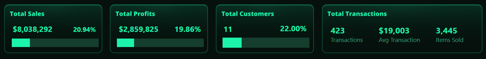
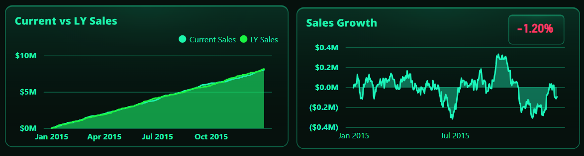
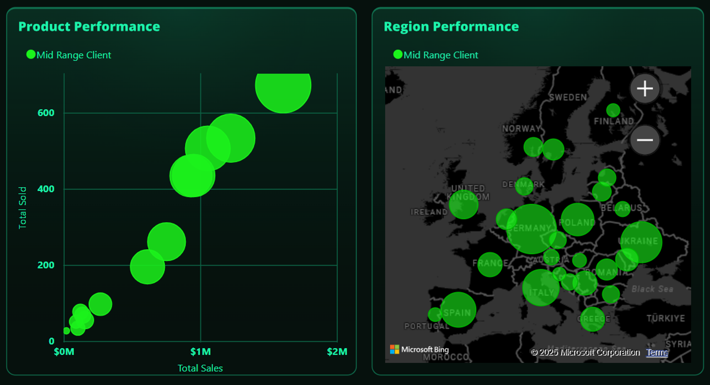

# Aurelia Ventures Strategic Customer Segmentation: A Power BI Case Study

<p align="center">
  <a href="https://tinyurl.com/ywmuyhsc" target="_blank">
    
  </a>
</p>

This repository details a Power BI customer segmentation analysis for "Aurelia Ventures," a fictional B2B distribution company. It demonstrates a data-driven approach to move beyond surface-level sales metrics and uncover which customer segments are truly driving the business, enabling a shift towards a more profitable and focused sales strategy.


## Table of Contents
- [1. Case Study Overview](#1-case-study-overview)
  - [The Business Problem: Unfocused Growth](#the-business-problem-unfocused-growth)
  - [The Solution: A Data-Driven Segmentation Hub](#the-solution-a-data-driven-segmentation-hub)
  - [Key Outcomes & Strategic Value](#key-outcomes--strategic-value)
  - [Tech Stack](#tech-stack)
- [2. The Analytical Approach](#2-the-analytical-approach)
  - [The Pareto Principle (80/20 Rule)](#the-pareto-principle-8020-rule)
  - [Visual Profiling of Segments](#visual-profiling-of-segments)
- [3. Repository Structure](#3-repository-structure)
- [4. How to Explore This Project](#4-how-to-explore-this-project)

---

## 1. Case Study Overview

### The Business Problem: Unfocused Growth
Aurelia Ventures achieved consistent sales growth but faced a new challenge: profitability was not keeping pace. The sales and marketing teams operated with a one-size-fits-all strategy, treating every customer with equal importance. This led to inefficient resource allocation, with significant time and effort spent on low-value accounts while high-potential clients were potentially underserved.

The leadership team needed answers to critical strategic questions:
*   Who are our most valuable customers?
*   Where should our sales team focus their efforts to maximize ROI?
*   Do different customer segments buy different products or concentrate in specific regions?

### The Solution: A Data-Driven Segmentation Hub
This Power BI dashboard was built to solve this problem by implementing a classic Pareto analysis. It ingests raw sales data and transforms it into an interactive strategic tool that segments the entire customer base into three distinct, actionable tiers: **Top Clients**, **Mid Range Clients**, and **Less Profitable Clients**.

This allows managers to dynamically filter the entire business view by segment, instantly revealing the unique characteristics and value of each group.

### Key Outcomes & Strategic Value
The dashboard provides a clear framework for strategic action:
*   **Identifies High-Value Segments:** Proves that a small percentage of "Top Clients" drive a disproportionately large share of sales and profits.
*   **Enables Targeted Strategies:** By understanding the unique product preferences and geographic locations of each segment, Aurelia Ventures can now tailor its marketing campaigns, product offerings, and sales outreach.
*   **Optimizes Resource Allocation:** Empowers the sales team to focus their premium, high-touch efforts on Top Clients, develop growth plans for Mid Range Clients, and serve Less Profitable Clients through lower-cost, automated channels.

### Tech Stack
*   **Analysis & Visualization:** Power BI Desktop & Power BI Service
*   **Modeling & Calculations:** DAX
*   **Data Transformation (ETL):** Power Query

---

## 2. The Analytical Approach: A Dashboard Deep Dive

The core of this analysis is a Pareto segmentation based on cumulative sales contribution, designed to identify the "vital few" customers who drive disproportionate value. The interactive dashboard is built to explore these segments from three distinct analytical angles: **Key Performance Indicators**, **Trend Analysis**, and **Behavioral Profiling**.

### 1. At-a-Glance KPIs: Quantifying Segment Value

The top panel of the dashboard immediately answers the most fundamental question: "How much is this segment worth?" It provides a snapshot of the segment's performance both in absolute terms and as a percentage of the entire company's performance.



*   **Sales & Profit Contribution:** Shows the segment's total revenue and profit, alongside its percentage contribution to the company's grand total (e.g., "Top Clients" might be 10% of customers but contribute 70% of profits).
*   **Customer & Transaction Volume:** Displays the number of unique customers in the segment and key transactional metrics like the total number of transactions, average transaction value, and total items sold.

### 2. Trend Analysis: Tracking Performance Over Time

Below the KPIs, two time-series charts analyze the segment's performance against historical data, answering the question, "Is this segment's performance improving?"



*   **Current vs LY Sales:** This cumulative chart provides a clear visual of the segment's growth trajectory throughout the year compared to the previous year. It instantly shows if performance is trending ahead of or behind schedule.
*   **Sales Growth:** This chart visualizes the monthly sales difference compared to the same month last year, highlighting periods of strong growth or decline.

### 3. Behavioral Profiling: Understanding "Who" and "Where"

The main body of the dashboard is dedicated to profiling the unique character of each segment, answering the strategic questions, "What do they buy, and where are they located?"



*   **Product Performance (Scatter Plot):** This powerful visual maps out the product mix for the selected segment. Each bubble is a product, showing its relationship between sales volume and total units sold. This helps identify if a segment prefers high-volume/low-cost products or low-volume/high-value products.
*   **Region Performance (Map):** This map visualizes the geographic footprint of the segment. It immediately reveals if the company's most valuable customers are concentrated in specific regions, which can inform logistics, regional marketing, and sales team allocation.

This multi-faceted approach transforms a simple list of customers into a rich, interactive strategic tool.

**For a complete breakdown of the segmentation methodology and every DAX formula, please see the detailed documentation in the `docs/` folder.**

---

## 3. Repository Structure
```
.
├── assets/
│   ├── segmentation_demo.gif
│   ├── customer_segmentation_dashboard.png
│   └── data_model.png
├── docs/
│   ├── 01_Business_Context.md
│   ├── 02_Segmentation_Methodology.md
│   └── 03_Data_Model_and_DAX.md
├── .gitignore
└── README.md
```

---

## 4. How to Explore This Project
1.  **Interact with the Live Dashboard:**
    *   Click the "Live Dashboard" badge at the top of this page or go directly to: [https://tinyurl.com/ywmuyhsc](https://tinyurl.com/ywmuyhsc)
2.  **Review the Documentation:**
    *   For a deeper understanding of the business logic and technical implementation, review the detailed markdown files in the `docs/` folder.


