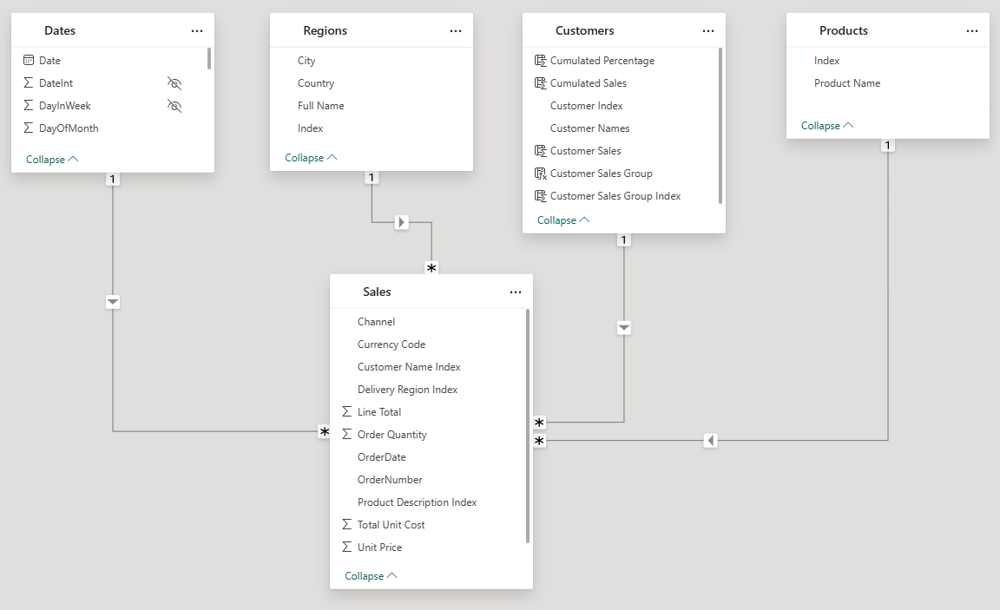

# 3. Data Model and Complete DAX Dictionary

This document outlines the technical foundation of the dashboard, including the data model structure and a complete dictionary of all DAX calculations used for the analysis.

## Data Model

The project utilizes a clean and efficient **Star Schema**. This model features a central `Sales` fact table connected to multiple descriptive dimension tables. This is a best-practice design that ensures optimal performance and analytical flexibility in Power BI.



### Table Descriptions
*   **Sales (Fact Table):** Contains the granular transactional data, with each row representing an order line item.
*   **Customers (Dimension Table):** Contains a unique list of all customers. This table is enriched with calculated columns to drive the segmentation.
*   **Products (Dimension Table):** A unique list of all products.
*   **Regions (Dimension Table):** Geographic data for customers.
*   **Dates (Dimension Table):** A standard calendar table for time-intelligence calculations.

---

## DAX Calculations

The following sections detail all DAX logic, separated into calculated columns (which define the segments) and measures (which perform the dynamic calculations).

### Part 1: Calculated Columns for Segmentation

These columns are added to the `Customers` table to perform the Pareto analysis. They are calculated once during data refresh and form the static foundation for the segmentation.

**1. Cumulated Sales (Calculated Column)**
*   **Purpose:** Ranks customers by their total sales and calculates a running total. This is a key step in identifying each customer's position in the overall sales distribution.
*   **Note:** This pattern relies on a `[Customer Sales]` column, which is assumed to hold the pre-aggregated total sales for each customer.
*   **DAX Code:**
    ```dax
    Cumulated Sales =
    CALCULATE(
        [Total Sales],
        FILTER(
            ALL(Customers),
            Customers[Customer Sales] >= EARLIER(Customers[Customer Sales])
        )
    )
    ```

**2. Cumulated Percentage (Calculated Column)**
*   **Purpose:** Converts the `Cumulated Sales` value into a percentage of the grand total sales. This value is what the `SWITCH` statement will use to assign a segment.
*   **DAX Code:**
    ```dax
    Cumulated Percentage =
    DIVIDE(
        Customers[Cumulated Sales],
        SUM(Customers[Customer Sales]),
        0
    )
    ```

**3. Customer Sales Group (Calculated Column)**
*   **Purpose:** The final step. This assigns a readable segment name ("Top Client", "Mid Range Client", etc.) to each customer based on their `Cumulated Percentage`. This column is used in the main slicer for the report.
*   **DAX Code:**
    ```dax
    Customer Sales Group =
    SWITCH(
        TRUE(),
        Customers[Cumulated Percentage] <= 0.7, "Top Client",
        Customers[Cumulated Percentage] <= 0.9, "Mid Range Client",
        "Less Profitable Client"
    )
    ```

---

### Part 2: Core KPI Measures

These are the fundamental measures used to calculate overall performance for the selected segment.

**`Total Sales`**
*   **Definition:** Calculates the total revenue from sales transactions.
*   **DAX Code:**
    ```dax
    Total Sales = SUMX(Sales, Sales[Order Quantity] * Sales[Unit Price])
    ```

**`Total Costs`**
*   **Definition:** Calculates the total cost of goods sold.
*   **DAX Code:**
    ```dax
    Total Costs = SUMX(Sales, Sales[Order Quantity] * Sales[Total Unit Cost])
    ```

**`Total Profits`**
*   **Definition:** Calculates the total profit by subtracting costs from sales.
*   **DAX Code:**
    ```dax
    Total Profits = [Total Sales] - [Total Costs]
    ```

**`Profit Margin`**
*   **Definition:** Calculates the percentage of sales revenue that is profit.
*   **DAX Code:**
    ```dax
    Profit Margin = DIVIDE([Total Profits], [Total Sales], 0)
    ```

**`Total Customers`**
*   **Definition:** Counts the number of unique customers within the current filter context.
*   **DAX Code:**
    ```dax
    Total Customers = DISTINCTCOUNT(Sales[Customer Name Index])
    ```

**`Total Transactions`**
*   **Definition:** Counts the total number of transaction line items.
*   **DAX Code:**
    ```dax
    Total Transactions = COUNTROWS(Sales)
    ```

**`Total Quantity Sold`**
*   **Definition:** Sums the total number of items sold.
*   **DAX Code:**
    ```dax
    Total Quantity Sold = SUM(Sales[Order Quantity])
    ```

**`Average Transaction`**
*   **Definition:** Calculates the average sales value per transaction line item.
*   **DAX Code:**
    ```dax
    Average Transaction = AVERAGEX(Sales, Sales[Order Quantity] * Sales[Unit Price])
    ```

---

### Part 3: Segment Contribution Measures

These measures compare the selected segment's performance to the company's grand total, answering questions like "What percentage of all profits comes from Top Clients?"

**`% of All Sales`**
*   **Definition:** Calculates the segment's sales as a percentage of the total sales across all segments.
*   **DAX Code:**
    ```dax
    % of All Sales =
    VAR All_Sales = CALCULATE([Total Sales], ALL(Customers[Customer Sales Group]))
    RETURN
        DIVIDE([Total Sales], All_Sales, 0)
    ```

**`% of All Profits`**
*   **Definition:** Calculates the segment's profits as a percentage of the total profits across all segments.
*   **DAX Code:**
    ```dax
    % of All Profits =
    VAR All_Profits = CALCULATE([Total Profits], ALL(Customers[Customer Sales Group]))
    RETURN
        DIVIDE([Total Profits], All_Profits, 0)
    ```

**`% of All Customer`**
*   **Definition:** Calculates the number of customers in the segment as a percentage of the total unique customers in the company.
*   **DAX Code:**
    ```dax
    % of All Customer =
    VAR All_Customer = CALCULATE([Total Customers], ALL(Customers[Customer Sales Group]))
    RETURN
        DIVIDE([Total Customers], All_Customer, 0)
    ```

---

### Part 4: Time-Intelligence Measures

These measures are used for trend analysis and comparing performance over time.

**`Sales LY`**
*   **Definition:** Calculates the `Total Sales` for the exact same period in the prior year.
*   **DAX Code:**
    ```dax
    Sales LY = CALCULATE([Total Sales], DATEADD(Dates[Date], -1, YEAR))
    ```

**`Cumulative Sales`**
*   **Definition:** Calculates the running total of sales from the beginning of the selected time period to the current date.
*   **DAX Code:**
    ```dax
    Cumulative Sales =
    CALCULATE(
        [Total Sales],
        FILTER(ALLSELECTED(Dates), Dates[Date] <= MAX(Dates[Date]))
    )
    ```

**`Cumulative Sales LY`**
*   **Definition:** Calculates the running total of sales for the prior year, for use in YoY cumulative charts.
*   **DAX Code:**
    ```dax
    Cumulative Sales LY =
    CALCULATE(
        [Sales LY],
        FILTER(ALLSELECTED(Dates), Dates[Date] <= MAX(Dates[Date]))
    )
    ```

**`Cumulative Sales Growth`**
*   **Definition:** Calculates the difference between the current cumulative sales and the prior year's cumulative sales.
*   **DAX Code:**
    ```dax
    Cumulative Sales Growth =
    VAR Cum_Sales_Diff = [Cumulative Sales] - [Cumulative Sales LY]
    RETURN
        CALCULATE(
            Cum_Sales_Diff,
            FILTER(ALLSELECTED(Dates), Dates[Date] <= MAX(Dates[Date]))
        )
    ```

**`% Sales Growth`**
*   **Definition:** Calculates the percentage growth of sales compared to the prior year.
*   **Note:** This measure requires a `[Sales Growth]` measure, which is typically `[Total Sales] - [Sales LY]`.
*   **DAX Code:**
    ```dax
    % Sales Growth = DIVIDE([Sales Growth], [Sales LY], 0)
    ```